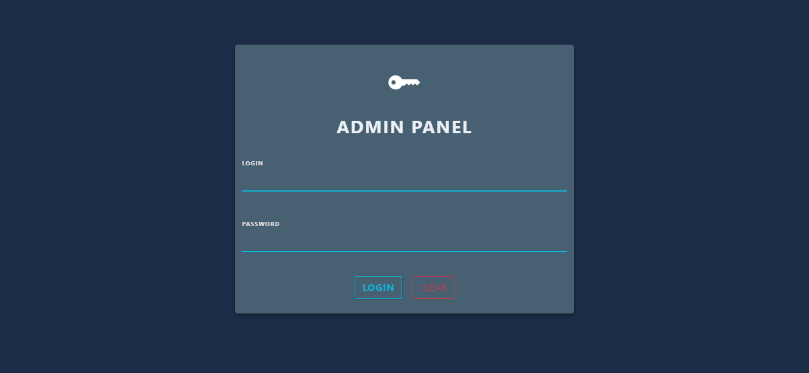
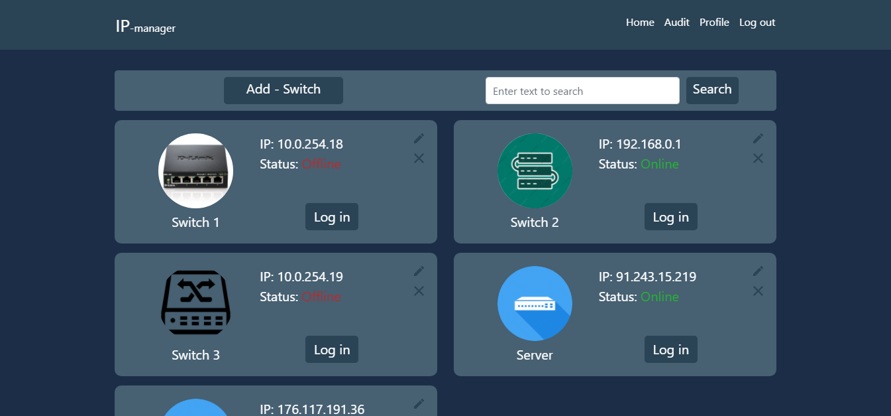
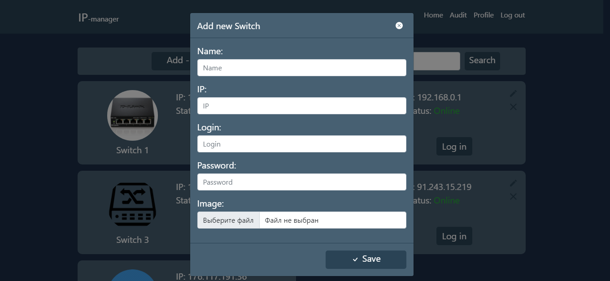
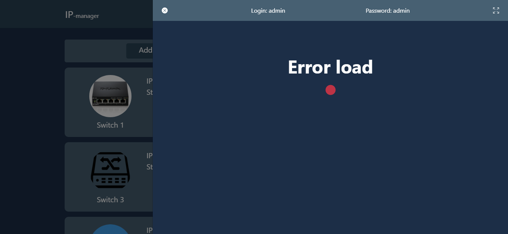
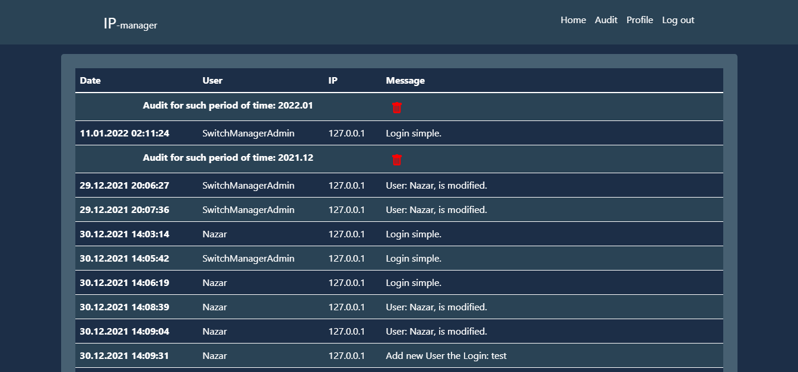
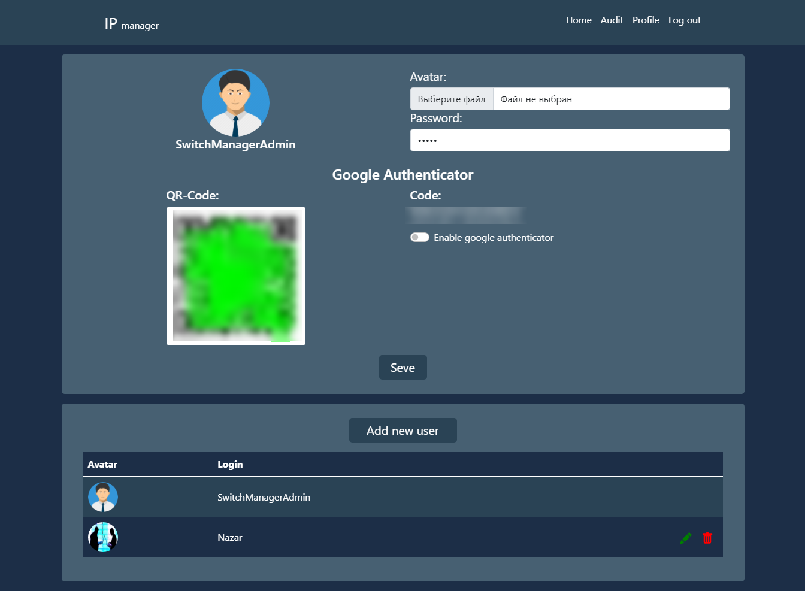

# switch-manager

<p align="center"></p>

## EN

This project is my joint project with a colleague, for the office where our practice was conducted.

This website is designed to manage switches and monitor their status. The site has dual Google authorization, <a target="_blank" href="https://www.google.com/url?sa=t&rct=j&q=&esrc=s&source=web&cd=&cad=rja&uact=8&ved=2ahUKEwjnmtm5uaj1AhXBDOwKHdfxC8YQFnoECAUQAQ&url=https%3A%2F%2Fplay.google.com%2Fstore%2Fapps%2Fdetails%3Fid%3Dcom.google.android.apps.authenticator2%26hl%3Duk%26gl%3DUS&usg=AOvVaw25KqBQdghvgpCgjEEAIhZb">details on this site</a>. The site also works with the database, the path to the database configuration file: <a target="_blank" href="https://github.com/CoolOtaku/switch-manager/blob/d04eadda6e63f3e5cd97f9c053470da7059f1fed/template/SQL_Connect.php">template/SQL_Connect.php</a>. Also passwords for users, QR codes and codes for double authorization in the database are not valid (this is done for security).

### Screenshots of the web site:

<p>
  
  
  
  
  
  
</p>

## UA

Це проект мій спільний з колегою проект, для кантори на якій проводилася наша практика.

Цей вебсайт 
признацений для керування комутаторами та моніторингом їх станів. На сайті присутня двійна Google авторизація, <a target="_blank" href="https://www.google.com/url?sa=t&rct=j&q=&esrc=s&source=web&cd=&cad=rja&uact=8&ved=2ahUKEwjnmtm5uaj1AhXBDOwKHdfxC8YQFnoECAUQAQ&url=https%3A%2F%2Fplay.google.com%2Fstore%2Fapps%2Fdetails%3Fid%3Dcom.google.android.apps.authenticator2%26hl%3Duk%26gl%3DUS&usg=AOvVaw25KqBQdghvgpCgjEEAIhZb">деталі на цьому сайті</a>. Також сайт працює з базою даних, шлях до файлу конфігурації БД: <a target="_blank" href="https://github.com/CoolOtaku/switch-manager/blob/d04eadda6e63f3e5cd97f9c053470da7059f1fed/template/SQL_Connect.php">template/SQL_Connect.php</a>. Також паролі для користувачів, QR коди та коди для двійної авторизації, в базі даних не дійсні (це зроблено для безпеки).

### Скріншоти вебсайту:

<p>
  
  
  
  
  
  
</p>

## Others

### License

```
© 2022, CoolOtaku (ericspz531@gmail.com)
```
